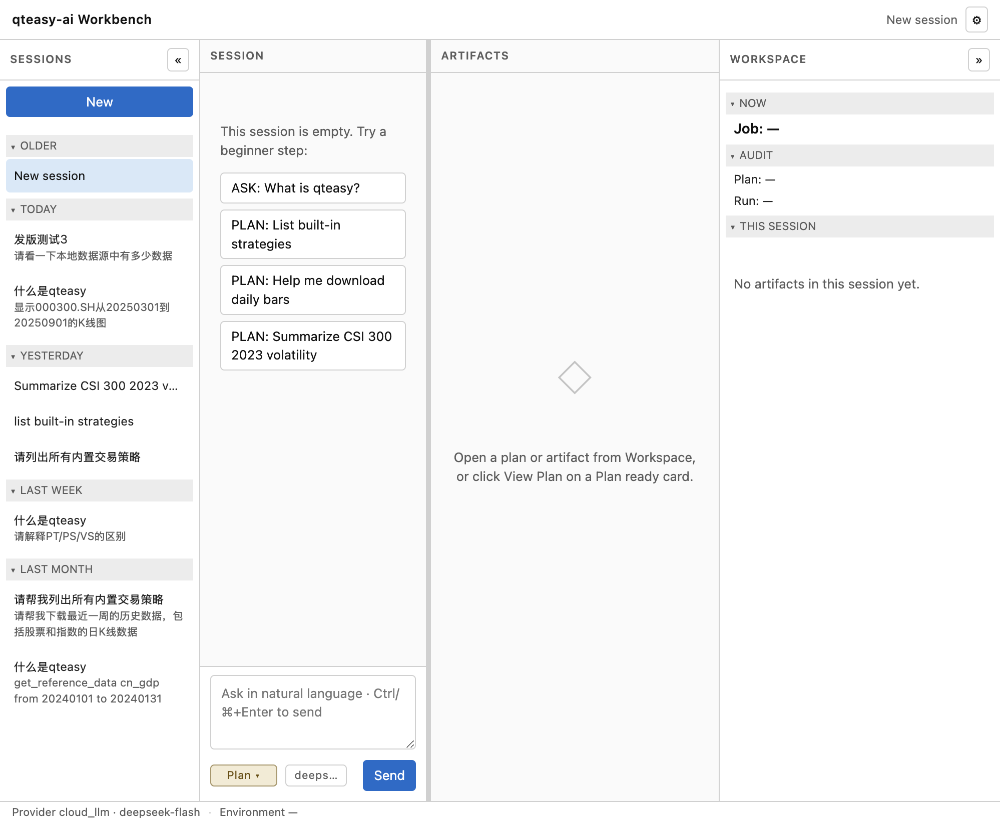
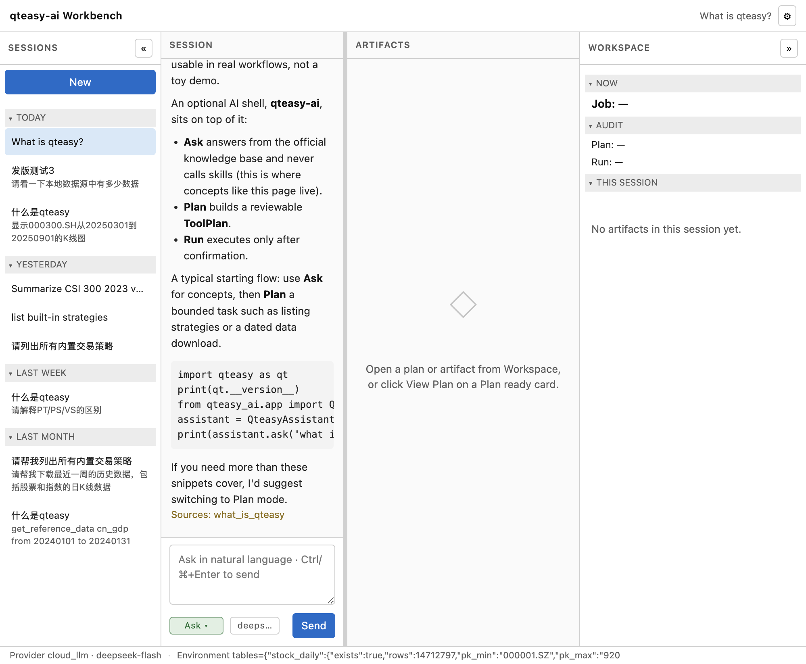
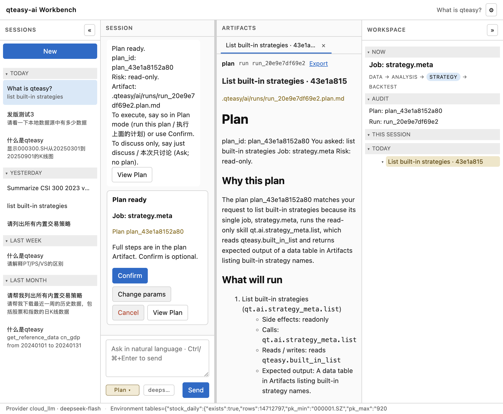
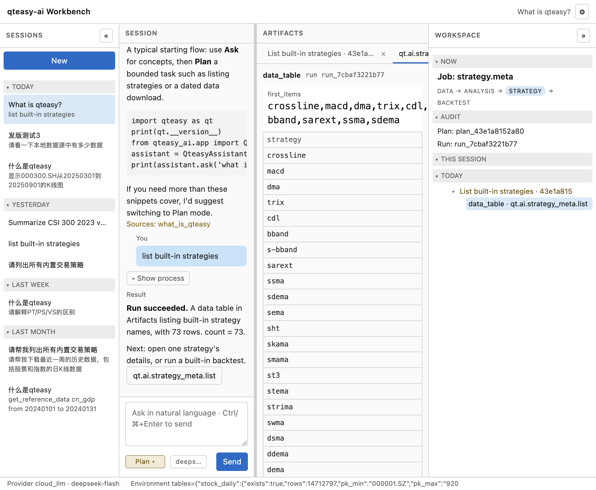
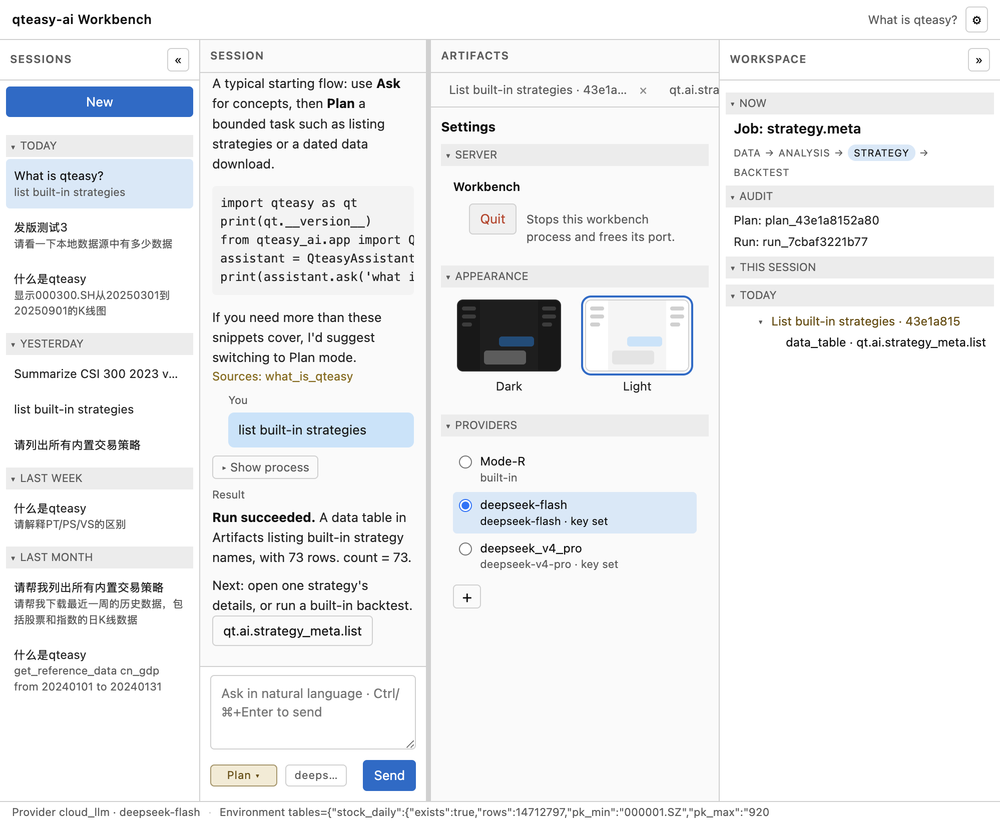

# qteasy-ai 使用说明

qteasy-ai 是 [qteasy](https://github.com/shepherdpp/qteasy) 的对话外壳。你用短句提问、出计划、确认后再取数、回测或优化，结果留在本机，方便以后查看。它不改 qteasy 的回测和交易规则。

本说明对应即将发布的 **0.2.0**。PyPI 上已有的 0.1.0 只包含最早的命令行骨架。

## 1. 本版能做什么

- 用 Ask 询问 qteasy 的概念和常见错误。Ask 不会下载数据，也不会跑回测。
- 用 Plan 把一件事拆成步骤，给你看完再决定是否执行。
- 确认之后再取数、看摘要、回测、优化，或按双均线模板写一份策略草稿。
- 在工作台里打开表格、图和计划说明。

## 2. 本版不做什么

- 不会自动下单。提到实盘时，只给出一份计划清单。
- 不会读论文或长篇附件。
- 不会盯盘、推送提醒。
- 官方问答覆盖的是入门问题，不是整站文档的镜像。

## 3. 安装

先有 qteasy，再装带工作台的 qteasy-ai：

```bash
pip install "qteasy>=2.6.0"
pip install "qteasy-ai[workbench]"
```

本地两仓一起改时：

```bash
pip install -e /path/to/qteasy
pip install -e /path/to/qteasy-ai
```

记忆、计划和运行记录默认在当前目录的 `.qteasy/ai/`。换目录可设置环境变量 `QTEASY_AI_HOME`。

## 4. 三种模式

界面上始终能看到当前模式。槽位填完不会自动变成执行。

| 模式 | 会做什么 |
|------|----------|
| **Ask** | 只回答。不调用技能，不写运行记录。 |
| **Plan** | 只生成计划，不执行。 |
| **Agent** | 执行你已经确认的计划。命令行里对应 `run`。 |

高副作用的步骤（下载、写库、回测、优化、写策略文件）必须先出现在计划里。你确认之后才会执行。

没有配置模型时仍然可用：Ask 用内置的英文知识库回答；Plan 按规则生成计划。错误和警告是英文，并会写下一步可以做什么。

## 5. 工作台

安装可选组件后启动：

```bash
qteasy-ai serve --host 127.0.0.1 --port 8765
```

浏览器打开 `http://127.0.0.1:8765`。

从左到右三栏：会话与对话、产物、工作区。工作区里能看到当前任务、本会话的产物索引。折叠左侧只改变对话栏宽度；折叠右侧只改变产物栏宽度。

Enter 换行。Ctrl 或 ⌘ 加 Enter 发送。下面的图来自浅色主题的本地工作台；右上角齿轮可切回暗色。



在 Ask 里问概念，回答出现在对话区：



在 Plan 里说一件要做的事。成功后对话里是一句短通知；完整计划在中间栏打开，里面有步骤和预期产物类型。改这份说明不会改变真正执行的内容。



确认之后，对话里出现结果卡，产物栏里可以打开表或图。确认不是必须立刻点的，它不会锁住输入框。



运行中可以点 **Stop** 或 **Background**：

- **Stop**：在下一步边界停下，本次结果丢弃。已经写入数据源的行不会回滚。
- **Background**：任务继续跑，你可以接着提问或再出一份计划。新的执行会等当前任务结束后再跑，等待中的下一次执行只保留最后一条。

最小文本界面没有产物栏，确认仍在对话里完成：

```bash
qteasy-ai tui --session-id demo
```

## 6. 模型（可以不配）

不配模型时，Ask 与 Plan 仍按上一节工作。

要让回答跟随你的语言、或让计划多一段说明，可以任选一种方式：

- 环境变量：`QTEASY_AI_MODEL`、`QTEASY_AI_API_KEY`、`QTEASY_AI_BASE_URL`。默认请求超时 120 秒，可用 `QTEASY_AI_TIMEOUT` 覆盖。
- 工作台 Settings 的 **PROVIDERS**：添加、修改、删除和切换。无模型的内置项不能删除。列表和诊断不会显示原始密钥。



命令行：

```bash
qteasy-ai provider list
qteasy-ai provider-check
```

`provider` 还有 `add`、`update`、`remove`、`use`。看参数用 `qteasy-ai provider add --help`。

## 7. 命令行最短路径

更完整的命令和 Notebook 写法见 [快速上手](tutorials/quickstart.md)。

```bash
qteasy-ai ask "what is qteasy"
qteasy-ai plan "show kline summary of 000300.SH"
qteasy-ai run --plan-id plan_xxxxxxxxxxxx
```

同一件事要分几句说完时，每句都带同一个 `--session-id`。计划生成之后，在 Plan 里说「请执行上面的计划」，或使用上面的 `run --plan-id`。

澄清时直接回答所缺的内容。`skip` 或「跳过」会结束这一句，不会替你猜。

## 8. 请留意

- 实盘请求只会生成计划，不会自动下单。
- 没有日期或区间过长的全市场下载会被拦住，需要你补上范围。
- 首次使用会在 `.qteasy/ai/user_kb/` 放好研究笔记的空目录。Ask 不搜索这个目录。
- 用自然语言写策略时走 Plan。当前模板是双均线择时，生成的源码在 `.qteasy/ai/strategies/`，不会改 qteasy 安装目录。

## 9. 延伸阅读

- 命令与 Notebook：[tutorials/quickstart.md](tutorials/quickstart.md)
- 官方能力目录：[OFFICIAL_SKILL_CATALOG.md](OFFICIAL_SKILL_CATALOG.md)
- 文档地图：[USER_DOCS_INDEX.md](USER_DOCS_INDEX.md)
